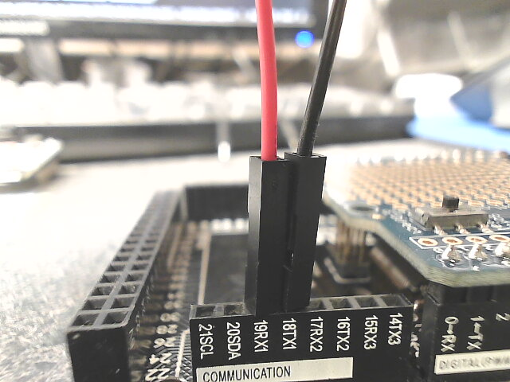
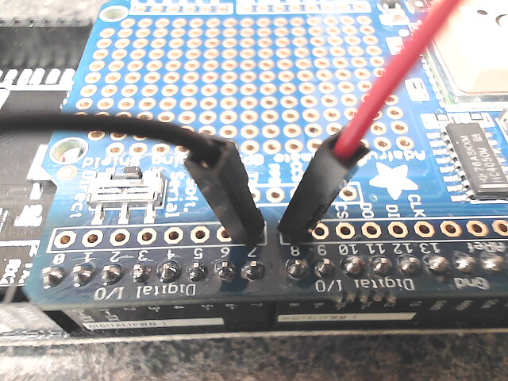
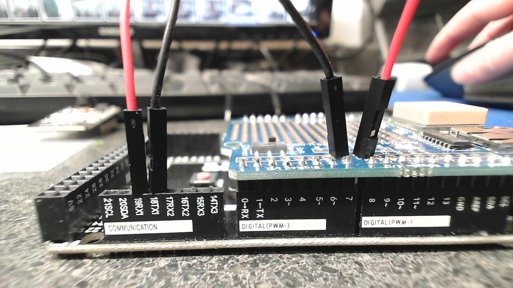

# GPS Logging (Mega)

GPS/Time/Pin Status logger for Arduino Mega

--- 

## Notes
### Mega R3
 - Adafruit Ultimate GPS Shields works directly plugged into board
 - Make sure to add a wire between TX1->D8(Shield) RX1->D7(Shield)

 - **Pins on Mega:**  

 - **Pins on Shield:**  

 - **Both**:  

